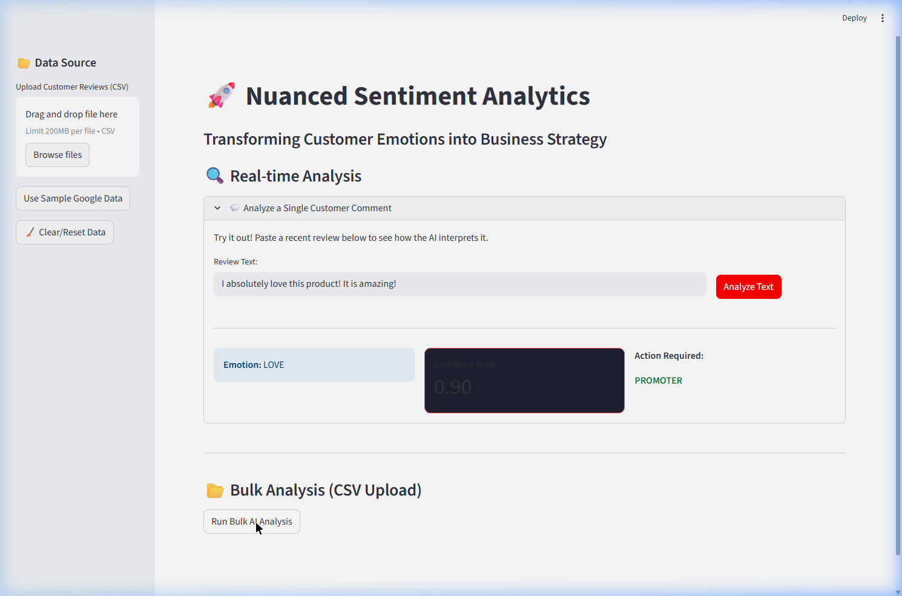
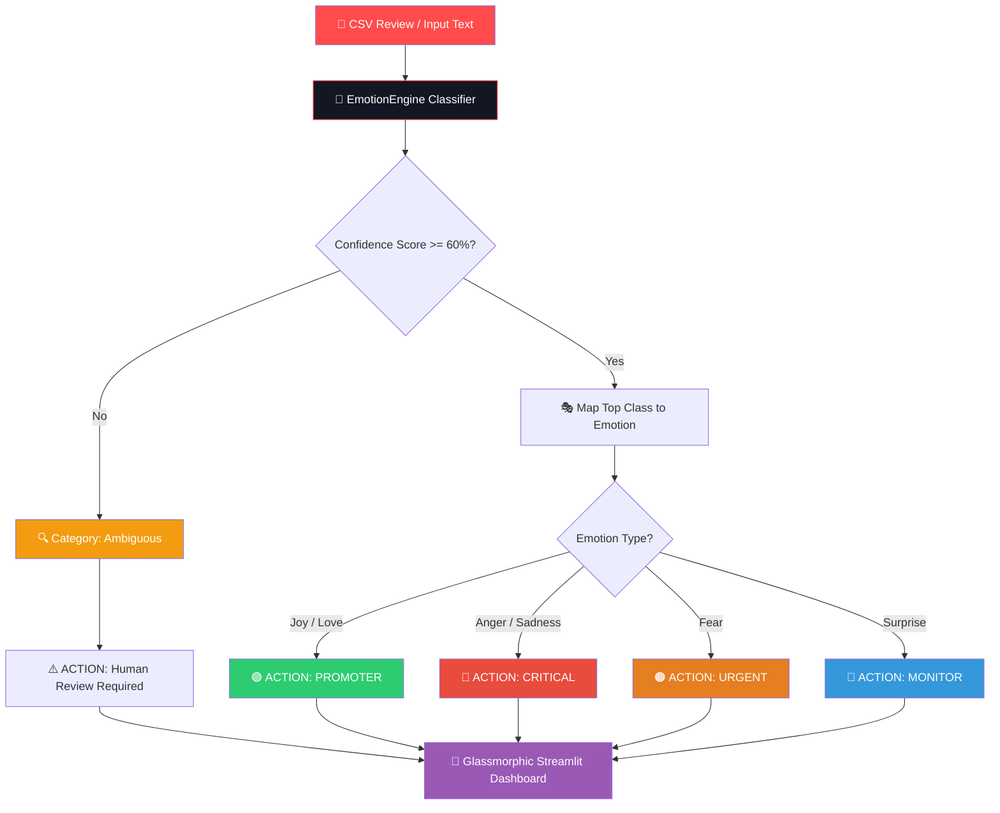

<div align="center">

# 🧠 Emotion Pro Analytics — Nuanced Sentiment & Business Alignment AI

[](https://git.io/typing-svg)


<br/>

[](https://nuance-flow-app.streamlit.app/)
[](https://github.com/mayank-goyal09/nuance-flow/stargazers)
[](https://github.com/mayank-goyal09/nuance-flow/network)

<br/>



<br/>

### 🧠 **Using Fine-Tuned DistilBERT embeddings to route customer emotions to action** 

### **From Raw Feedback Reviews → Real-Time Strategic Response Workflows** 🚀

</div>

---

## ⚡ **THE ANALYSIS AT A GLANCE**

<table>
<tr>
<td width="50%">

### 🎯 **What This Project Does**

Emotion Pro is an **AI-powered intelligence pipeline** designed to go far beyond binary positive/negative sentiment. It identifies **6 complex human emotions** in customer reviews and dynamically routes predictions directly to distinct operational response workflows.

**The Complete Pipeline:**
- 📡 **Dataset Harvesting** → Downloads Google's GoEmotions from Hugging Face
- ✂️ **Tokenization & Preprocessing** → Sentence encoding via lightweight PyTorch loaders
- 🧠 **Supervised Fine-Tuning** → Retrains pre-trained **DistilBERT** architectures
- 📊 **Strategic Response Routing** → Maps emotion labels to action priority badges
- 🛡️ **Uncertainty Classification Gate** → Isolates ambiguous entries for human audit
- 🎨 **Glassmorphic UI Dashboard** → Renders real-time gauges, tab panels, and donuts

</td>
<td width="50%">

### ✨ **Key Highlights**

| Feature | Details |
|---------|---------|
| 🔬 **Fine-Grained NLP** | Classifies 6 business-critical emotions |
| 🛡️ **Uncertainty Safety** | Autodetects Ambiguity under 60% confidence |
| 🚨 **Priority Escalation** | Direct matching to 4 operational response buckets |
| 📂 **CSV Bulk Processing** | Batch updates visualizing reviews in seconds |
| 🍩 **Interactive Plots** | Real-time Plotly charts & detailed metrics |
| 🎨 **UI Aesthetics** | Premium Dark Glassmorphism & Floating Emojis |
| 💻 **Responsive** | Built on Streamlit for desktop and mobile runs |
| ⚡ **Performance** | Resource optimized caching for quick model runs |

</td>
</tr>
</table>

---

## 🛠️ **TECHNOLOGY STACK**

<div align="center">


</div>

| **Category** | **Technologies** | **Purpose** |
|:------------:|:-----------------|:------------|
| 🐍 **Core Language** | Python 3.8+ | Primary backend development language |
| 🧠 **Deep Learning** | PyTorch (torch) | Core framework supporting tensor arithmetic |
| 🤗 **NLP / Transformers** | Hugging Face (transformers, datasets) | Pre-trained model loading, tokenization & fine-tuning |
| 🎨 **Frontend UI** | Streamlit | Glassmorphic web interface and control dashboard |
| 📈 **Data Visualization** | Plotly / Pandas | Interactive donut and bar priority diagrams |
| 🧬 **Data Science** | Scikit-Learn | Training/validation split & scoring computations |

---

## 🔬 **HOW EMOTION PRO WORKS**



### **The Strategic Actions Breakdown:**

<table>
<tr>
<td>

#### 🟢 **1. Promoters (Joy, Love)**
Identifies highly satisfied customer brand advocates. Routable directly to marketing channels for referral signups, testimonial acquisition, or discount coupons.

</td>
<td>

#### 🔴 **2. Critical Issues (Anger, Sadness)**
Captures frustrated or disappointed customers experiencing product breakdowns or shipping delays. Routes directly to active Customer Service queues for instant resolution.

</td>
</tr>
<tr>
<td>

#### 🟠 **3. Urgent Alarms (Fear)**
Identifies extreme security, payment failure, account hacking, or safety concerns (e.g., overheating issues). Escalates straight to senior developers or executives.

</td>
<td>

#### 🔵 **4. General Monitoring (Surprise)**
Catches customers shocked by unexpected product behavior (negative or positive), helping product managers track unexpected UX outcomes or feature discoverability.

</td>
</tr>
</table>

---

## ⚠️ **KEY PROBLEMS FACED & STRATEGIC FIXES**

Developing and deploying a deep learning model locally presented several interesting integration bugs. Here is how they were systematically resolved:

### 1. The Missing Tokenizer Bug ⚠️
* **The Bug**: During local model serialization inside the training pipeline, only raw model weights and structural parameters were written to `./final_emotion_model`. Running prediction scripts caused immediate execution crashes because the Hugging Face pipeline could not identify tokenizer assets (`tokenizer.json`, `vocab.txt`).
* **The Fix**: Patched `train.py` to systematically export the vocabulary assets alongside the weights using:
  ```python
  from preprocess import tokenizer
  tokenizer.save_pretrained("./final_emotion_model_v2")
  ```

### 2. Unmapped Raw Classifier Classes (`LABEL_X` Output) 🏷️
* **The Bug**: Predictions initially output generic indices (`LABEL_0`, `LABEL_1`, etc.) because the saved configuration file lacked custom emotion definitions. This ruined analytics mapping as the frontend expected raw strings.
* **The Fix**: Configured exact labeling hashes directly in the initialization phase of the classification model head:
  ```python
  TARGET_EMOTIONS = ['joy', 'love', 'anger', 'sadness', 'fear', 'surprise']
  id2label = {i: label for i, label in enumerate(TARGET_EMOTIONS)}
  label2id = {label: i for i, label in enumerate(TARGET_EMOTIONS)}
  ```

### 3. Streamlit Page Rerun State Losses 🔄
* **The Bug**: Due to Streamlit's structural layout rendering model, standard buttons behave as instantaneous triggers. Clicking custom text analysis triggered page refreshes which immediately dropped uploaded CSV inputs, throwing the user back to the starting dashboard menu.
* **The Fix**: Refactored `app.py` utilizing Streamlit's `st.session_state` API to bind data frames globally:
  ```python
  if "df" not in st.session_state:
      st.session_state.df = None
  ```
  This retains datasets indefinitely until cleared by the user via a dedicated sidebar **🧹 Clear/Reset** widget.

### 4. Over-Automating Mixed Reviews (False Positives) 🛡️
* **The Bug**: Sarcastic, mixed, or poorly structured comments (e.g., *"I hate this app, but I love the support team"*) returned low prediction confidence values, leading to incorrect routing.
* **The Fix**: Embedded a custom **Uncertainty Filter Gate** directly into prediction modules. Any top-tier prediction scoring a confidence coefficient of `< 0.60` is flagged as **"Ambiguous"**, mapping automatically to **"Human Review Required 🔍"** to prevent automated response failures.

### 5. Streamlit Deployment: Missing Local Weights (Hugging Face Hub Migration) 🚀
* **The Bug**: To keep the GitHub repository lightweight and prevent pushing 260MB model binaries, `.gitignore` excludes `final_emotion_model_v2/`. Consequently, Streamlit Cloud deployments crashed on startup because they couldn't find the model weights locally.
* **The Fix**: Created a secure [upload_to_hf.py](file:///c:/my_local_data%28one%20drive%29/Attachments/Ambition%20course/my_all_projects/project%2062%20Emotion-Analytics/upload_to_hf.py) script to automatically login and push the local fine-tuned model to the Hugging Face Model Hub under `mayankg09/emotion-analytics-distilbert`. Patched [engine.py](file:///c:/my_local_data%28one%20drive%29/Attachments/Ambition%20course/my_all_projects/project%2062%20Emotion-Analytics/engine.py) to implement a **hybrid loader** that searches for the local model folder first, dynamically falling back to download from Hugging Face Hub when deployed online.

### 6. Hidden Floating Emoji Background (CSS Stack Layering) 🎨
* **The Bug**: Standard Streamlit structural container viewports (`stAppViewContainer` and `stMainViewContainer`) render with default solid background layers, overlapping and completely hiding the fixed custom `.emoji-bg` layout (at `z-index: -1`).
* **The Fix**: Refactored the dashboard styling inside [app.py](file:///c:/my_local_data%28one%20drive%29/Attachments/Ambition%20course/my_all_projects/project%2062%20Emotion-Analytics/app.py) to bind the radial gradient to the base `html` tag, making all internal Streamlit wrappers completely transparent (`background: transparent !important`). This exposes the floating emojis behind all content cards without affecting the page's interactivity.

### 7. NLP Case Study: Semantic Ambiguity & Machine Bias (Curiosity vs. Surprise) 🔬
* **The Inquiry**: To test the boundaries of our pipeline, we inputted a complex, grammatically structured freelance query:
  > *"so, as you know, I have texted with you so many things about freelancing earlier. On the basis of my history, can you please find out without the drawbacks?"*
* **The Model Output**: It classified the sentence as **`surprise`** with **`67.03%` confidence** (routing to the `MONITOR` action bucket).
* **The MLOps Insight**: While a human reads this as a polite request/inquiry based on *Curiosity*, the transformer model associates structural components (e.g. the conversational starting tag *"so, as you know..."*, direct negation *"without"*, and final question mark) with statistical characteristics of "surprise" and "confusion" present in GoEmotions. This case study demonstrates why the **60% Uncertainty Gate** and non-disruptive priority mapping (like **`MONITOR`**) are critical for real-world deployments to prevent automated customer workflow failures.

---

## 📂 **PROJECT STRUCTURE**

```text
🧠 Emotion-Analytics/
│
├── 📂 final_emotion_model_v2/   # Fine-tuned model weights, config, and tokenizer assets
├── 📂 emotion_model_results/    # Saved checkpoint outputs generated during training epochs
├── 📂 logs/                     # Local training logs
│
├── ⚙️ engine.py                 # Prediction pipeline class & Strategic Action mapper
├── 📊 app.py                    # Streamlit Glassmorphic dark UI layout
│
├── 📈 preprocess.py             # GoEmotions tokenization & train/test dataset splits (80/20)
├── 🧬 train.py                  # PyTorch model trainer using Hugging Face's Trainer API
├── 📡 data_loader.py            # Dataset fetcher isolating targeted business-critical labels
│
├── 🧪 generate_test_data.py     # Generates balanced mock datasets for QA evaluations
├── 📦 requirements.txt          # Python package requirements
├── 📊 dashboard.png             # UI interface preview asset
└── 📖 README.md                 # Project documentation (You are here!) 🚀
```

---

## 🚀 **QUICK START GUIDE**

<div align="center">


</div>

### **Step 1: Clone the Repository** 📥

```bash
git clone https://github.com/mayank-goyal09/nuance-flow.git
cd nuance-flow
```

### **Step 2: Create a Virtual Environment** 🐍

```bash
python -m venv venv
source venv/bin/activate  # On Windows: venv\Scripts\activate
```

### **Step 3: Install Required Packages** 📦

```bash
pip install -r requirements.txt
```

### **Step 4: Download and Fine-Tune the Brain** 🧠

```bash
# 1. Harvest & filter Google's GoEmotions Dataset
python data_loader.py

# 2. Preprocess text, split, and run fine-tuning on DistilBERT
python train.py
```
*Note: Training spans 6 full epochs to guarantee convergence. Optimization results in saving the fine-tuned classifier to `./final_emotion_model_v2`.*

### **Step 5: Launch the Streamlit Dashboard** 🖥️

```bash
streamlit run app.py
```

---

## 📚 **SKILLS DEMONSTRATED**

| **Category** | **Skills** |
|:-------------|:-----------|
| 🧠 **Deep Learning** | Supervised Fine-Tuning, Transformer Architecture (DistilBERT), PyTorch tensor mapping |
| 📊 **NLP Engineering** | Sequence tokenization, Vocabulary configuration, Custom label mapping, Multi-class filtering |
| 🎨 **UI/UX Craftsmanship** | Dark Mode design, HTML/CSS layout configuration, Custom keyframe animations, Glassmorphism panels |
| 📈 **Data Visualization** | Plotly charts, Multi-class donut distribution mapping, Real-time metrics visualization |
| 🚀 **MLOps & Engineering** | Local model serializations, tokenizer caching, UI State Management configurations |

---

## 🔮 **FUTURE ENHANCEMENTS**

- [ ] 🤖 **Generative Auto-Replies**: Use LLMs to draft context-appropriate responses matching predicted emotions.
- [ ] 📈 **Sentiment Chronology**: Track dynamic emotional changes inside multi-paragraph ticket updates.
- [ ] 📧 **Zapier/CRM Connectors**: Automatically trigger alerts in Slack, Salesforce, or Zendesk based on action labels.
- [ ] 🌐 **Multi-Lingual Inference**: Add support for French, Spanish, German, and Hindi feedback inputs.

---

## 👨‍💻 **CONNECT WITH ME**

<div align="center">

[](https://github.com/mayank-goyal09)
[](https://www.linkedin.com/in/mayank-goyal-4b8756363/)
[](https://mayank-goyal09.github.io/)

**Mayank Goyal**  
🧠 AI Engineer | 📊 NLP Specialist | ⚖️ Machine Learning Developer

</div>

---

<div align="center">

### 🧠 **Built with PyTorch, Streamlit & ❤️ by Mayank Goyal**

*"Decoding customer emotions, automating business action."* 🧠🚀


</div>
